# .NET-MVC-Project
A project usnig ASP.NET Core MVC.  

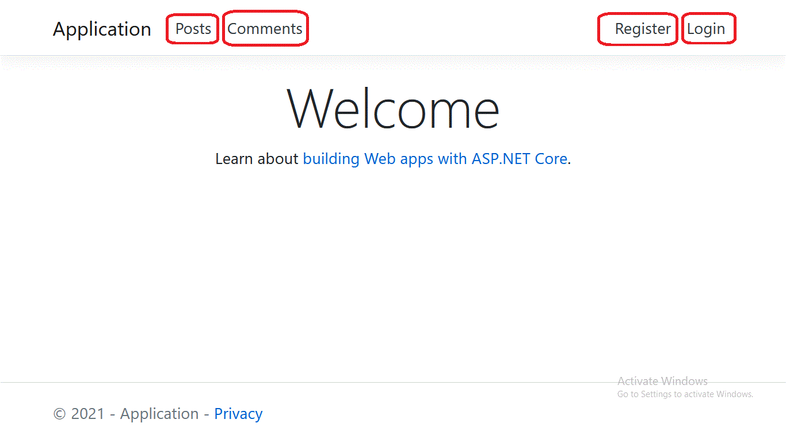

# A) About:

## A-1) Topic:
This is a simple Social Application.

## A-2) Technologies Used:
1. ASP.NET Core
2. ASP.NET Core MVC
3. Entity Framework
4. Identity (Individual)

# B) Models:

## B-1) Identity (Individual):
This is used for Authentication.

## B-2) Post:
Users Create Posts

Fields:
- **`PostId`** (integer)
- **`Content`** (string)
- **`AuthorId`** (string) (Relationship with Identity Model)

The AuthorId is id of the user Who Created the Post.

## B-3) Comment:
Users Create Commnets Related to Posts.

Fields:
- **`CommentId`** (integer)
- **`Content`** (string)
- **`PostId`** (string) (Relationship with Post Model)
- **`AuthorId`** (string) (Relationship with Identity Model)

The AuthorId is id of the user Who Created the Comment.

# C) Authentication:

## C-1) Relax:
**This is not custom authentication.**  
It is built in and tested **Identity Authentication**.  

## C-2) Not Logged in User:
If the user is not logged in, then he will see **Login** and **Register**
Buttons.
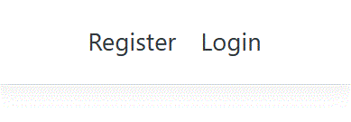

## C-3) Registration:
Now, when clicking the Register button, the user will be taken to the registeration page.
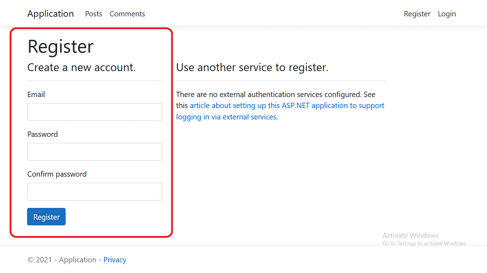

## C-4) Logged In User:
Now, that the user is logged in, the navbar will change.
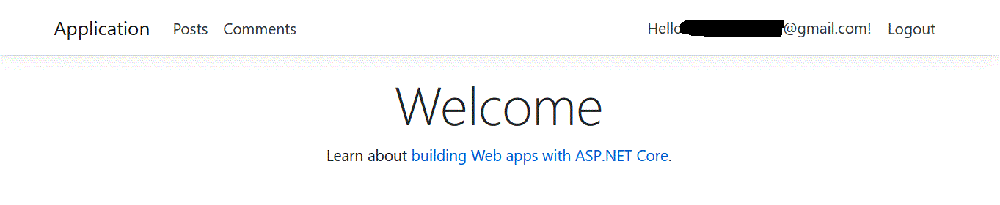

## C-5) Logging Out:
The **Log Out** button will log you out, if you are logged in.
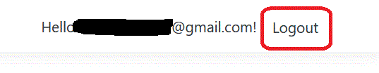

## C-6) Manage Your Account:

When you click on the **Hello Button**, you will be able to manage your account.

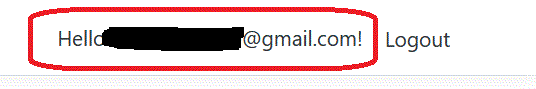

You can edit you Profile.

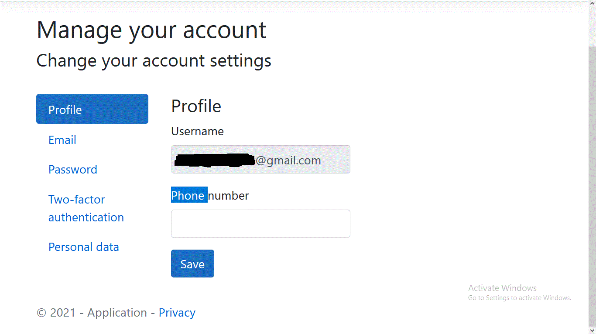

Email, password, 2FA and Personal Data.

# D) Post Model:

## D-1) Navigate:

In the Nav Bar, you can find the **Posts** Link.

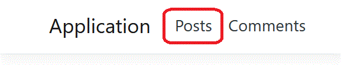

## D-2) Posts List:

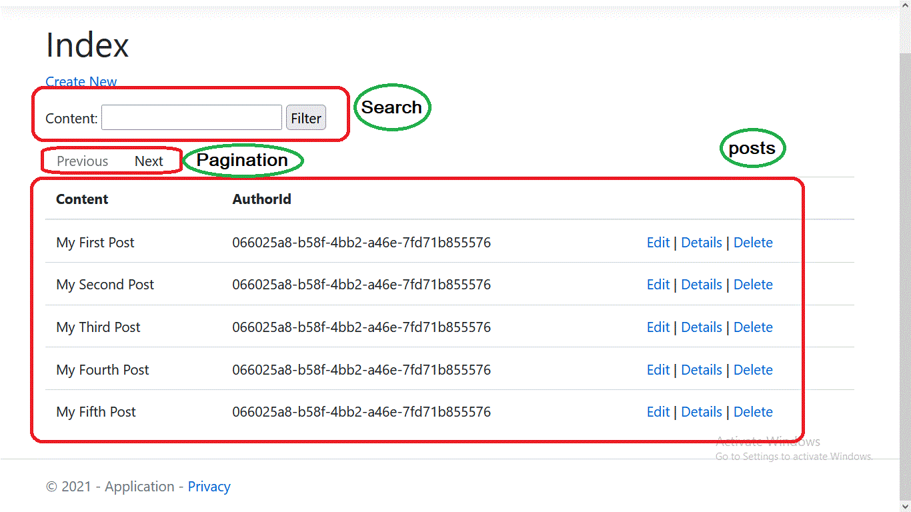

# E) Comments Model:

## E-1) Navigate:

In the Nav Bar, you can find the **Comments** Link.

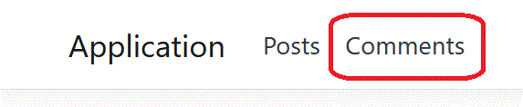

## E-2) Comments List:

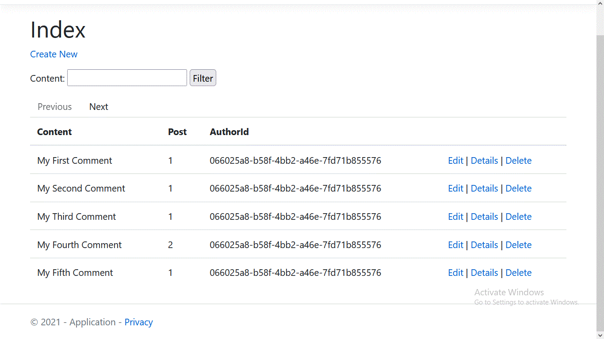

# F) Validation (Using Data Annotations):

Data annotations are used to validate inputs.

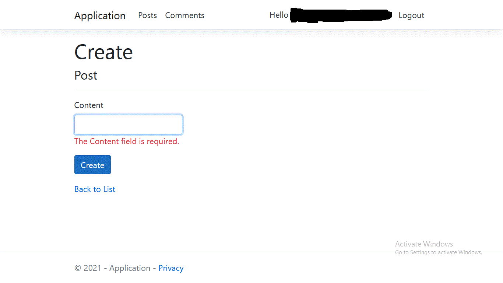

# G) Permissions:

- Non Logged-in users can only view the data

- Logged in users can view, create, update and delete data

